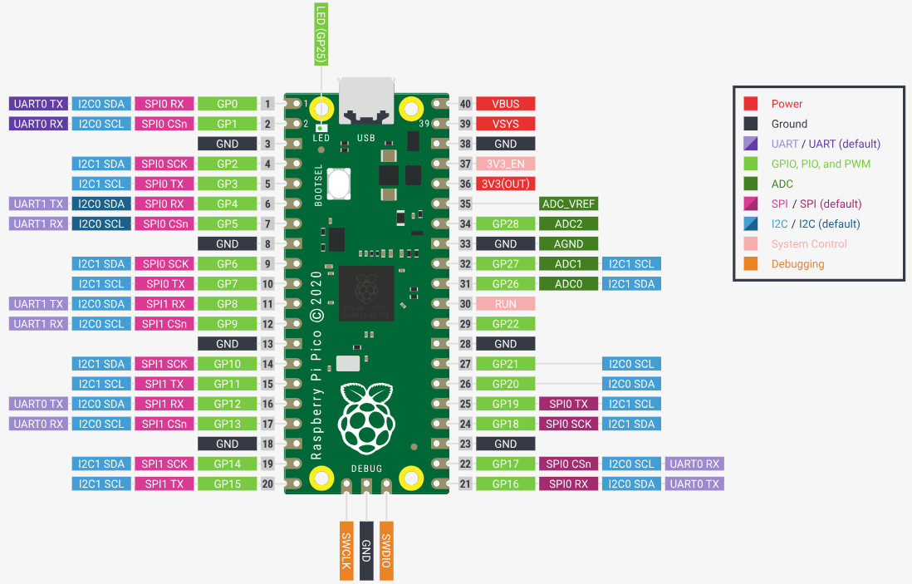
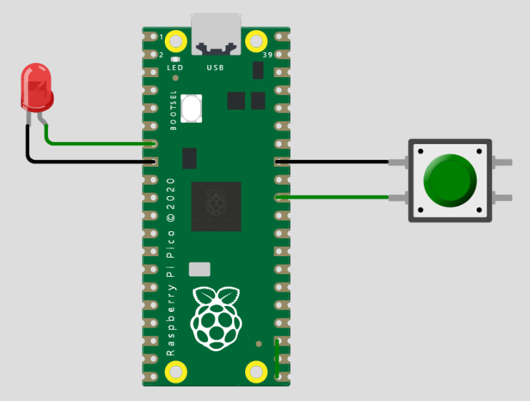
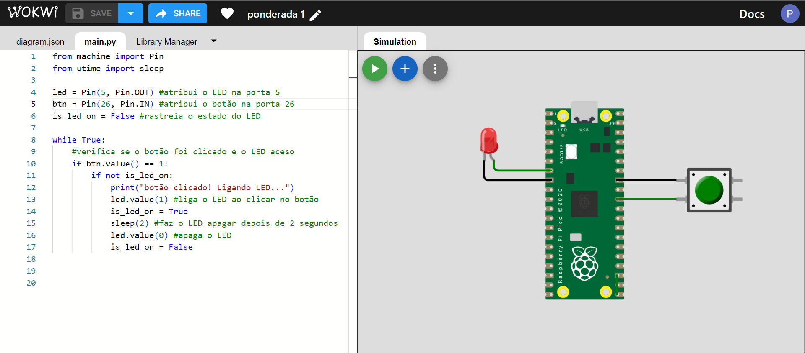
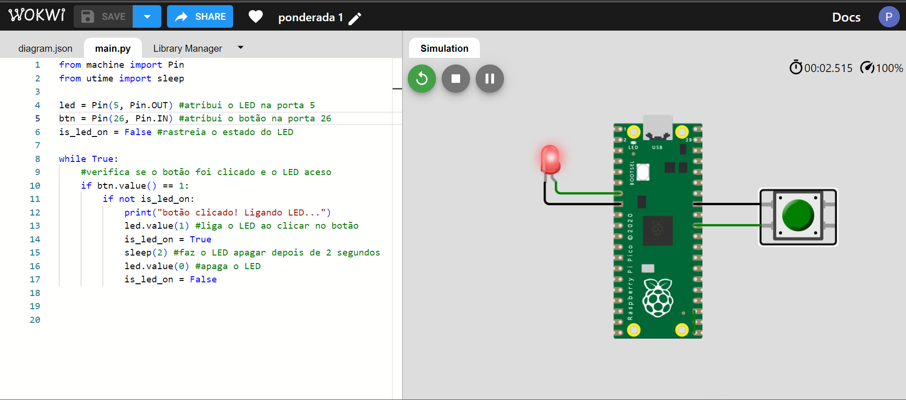

# Manual de Referência do Raspberry Pi Pico W

Edição 1.0 - Data de Publicação: 23 de Outubro de 2023

## Índice

1. [Introdução](#1-introdução)
* [Sobre o Raspberry Pi Pico W](#sobre-o-raspberry-pi-pico-w)
* [Finalidade deste Manual](#finalidade-desse-manual)

2. [Especificações Técnicas](#2-especificações-técnicas)
* [Processador](#processador)
* [Memória](#memória)
* [Conectividade](#conectividade)
* [GPIO (Mapeamento de Pinos)](#gpio-mapeamento-de-pinos)
* [Alimentação](#alimentação)
* [Temperatura de operação](#temperatura-de-operação)
* [Dimensões Físicas](#dimensões-físicas)

3. [Pinout (Mapeamento de Pinos)](#3-pinout-mapeamento-de-pinos)
* [GPIO](#gpio-general-purpose-inputoutput)
* [UART](#uart-universal-asynchronous-receiver-transmitter)
* [SPI](#spi-serial-peripheral-interface)
* [I2C](#i2c-inter-integrated-circuit)
* [ADC](#adc-conversor-analógico-digital)
* [Fonte de Energia](#fonte-de-energia)
* [Pinos de Controle](#pinos-de-controle)

4. [Alimentação e Conexões](#4-alimentação-e-conexões)
* [Alimentando o Raspberry Pi Pico W](#alimentando-o-raspberry-pi-pico-w)
* [Conexões USB](#conexões-usb)
* [Conexão Wi-Fi e Bluetooth](#conexão-wi-fi-e-bluetooth)

5. [Programação e Desenvolvimento](#5-programação-e-desenvolvimento)
* [Ambiente de Desenvolvimento](#ambiente-de-desenvolvimento)
* [Programação em MicroPython](#programação-em-micropython)
* [Programação em C/C++](#programação-em-cc)

6. [Prova de Conceito](#6-prova-de-conceito-comunicação-spi-com-sensor-de-luz)
* [Preparando o Hardware](#preparando-o-hardware)
* [Desenvolvendo o Software](#desenvolvendo-o-software)
* [Executando a Prova de Conceito](#executando-a-prova-de-conceito)
* [Resultados e Análises](#resultados-e-análise)

## 1. Introdução

### Sobre o Raspberry Pi Pico W

O Raspberry Pi Pico W é um microcontrolador desenvolvido pela Raspberry Pi Foundation. Ele combina a facilidade de uso do Raspberry Pi com a versatilidade de um microcontrolador. O Raspberry Pi Pico W é uma excelente escolha para projetos que necessitem de alto desempenho, baixo custo e conectividade sem fio. Este manual fornece informações detalhadas sobre o Pico W e suas capacidades.

### Finalidade desse manual

Este manual tem como objetivo fornecer uma referência completa sobre o Raspberry Pi Pico W, desde suas especificações técnicas até uma prova de conceito para demonstrar como utilizar suas interfaces de comunicação. Ele é produzido para melhor compreensão do hardware a ser utilizado no projeto de um tapete de acessibilidade conduzido por alunos de Ciência da Computação do Instituto de Tecnologia e Liderança (Inteli).

## 2. Especificações Técnicas
	
### Processador
* Processador: RP2040 Dual-core ARM Cortex-M0+
* Clock: 133 MHz

### Memória
* Memória Flash: 2 MB QSPI flash
* Memória SRAM: 264KB

### Conectividade
* Wi-Fi: 2.4GHz IEEE 802.11b/g/n
* Bluetooth: Bluetooth 5.2 (BLE)
* Antenas: Antenas embutidas

### GPIO (Mapeamento de Pinos)
O Raspberry Pi Pico W possui 40 pinos GPIO que podem ser usados para interagir com sensores, dispositivos e periféricos, sendo 26 deles multifuncionais, dos quais 3 ADC. Consulte o apêndice Pinout (Mapeamento de Pinos) para um mapeamento completo dos pinos e suas funções.

### Alimentação
* Tensão de Alimentação: 1.8 - 5.5V DC ou 5V USB
* Corrente Máxima: 500 mA

### Temperatura de operação
* De -20°C a 70°C;

### Dimensões Físicas
* Dimensões: 21,0 mm x 51,0 mm x 4,0 mm

## 3. Pinout (Mapeamento de Pinos)

O Raspberry Pi Pico W é equipado com um conjunto de pinos GPIO que podem ser usados para interagir com diversos dispositivos e periféricos externos. Abaixo, você encontrará um diagrama que mostra o mapeamento de pinos do Raspberry Pi Pico W, incluindo as funções e as características de cada pino:

 
Imagem 1: diagrama de pinos do Raspberry Pi Pico W.

### GPIO (General-Purpose Input/Output)

Os pinos são distribuídos de 0 a 28, isto é, GPIO0, GPIO1 … GPIO28, sendo todos pinos de uso geral.

### UART (Universal Asynchronous Receiver-Transmitter)

O Raspberry Pi Pico W suporta comunicação UART (serial). Abaixo estão os pinos UART disponíveis:
* **UART0_TX (Transmit)**: Conecte dispositivos que desejam receber dados transmitidos do Pico W.
* **UART0_RX (Receive)**: Conecte dispositivos que desejam transmitir dados para o Pico W.

### SPI (Serial Peripheral Interface)

O Raspberry Pi Pico W suporta comunicação SPI para interagir com dispositivos que usam esse protocolo. Os pinos SPI disponíveis são:
* **SPI0_SCK**: Clock da interface SPI.
* **SPI0_TX**: Saída de dados mestres.
* **SPI0_RX**: Entrada de dados mestres.
* **SPI0_CSn**: Sinal de seleção de chip para dispositivos SPI.

### I2C (Inter-Integrated Circuit)

A comunicação I2C é suportada pelo Raspberry Pi Pico W. Os pinos I2C disponíveis são:
* **I2C0_SCL**: Linha de clock I2C que sincroniza o sistema.
* **I2C0_SDA**: Linha de dados I2C que envia e recebe dados.

### ADC (Conversor Analógico-Digital) 

* **ADC0**: Pino que suporta leitura analógica, permitindo que você meça uma tensão entre 0 e 3,3 V.
* **ADC1**: Pino que suporta leitura analógica, permitindo que você meça uma tensão entre 0 e 3,3 V.
* **ADC2**: Pino que suporta leitura analógica, permitindo que você meça uma tensão entre 0 e 3,3 V.

### Fonte de Energia

* **3V3(OUT)**: Tensão de saída de 3,3 V.
* **3V3_EN**: Tensão de entrada de 3,3 V.

### Pinos de Controle

* **EN**: Pino de habilitação do sistema.
* **BOOTSEL**: Pino de seleção de modo de inicialização.

## 4. Alimentação e Conexões

### Alimentando o Raspberry Pi Pico W

O Raspberry Pi Pico W é alimentado via porta USB-C. Certifique-se de usar uma fonte de alimentação adequada com uma tensão de 5 V e uma corrente máxima de 500 mA.

### Conexões USB

O Raspberry Pi Pico W pode ser conectado a um computador através da porta USB-C para fins de programação e alimentação.

### Conexão Wi-Fi e Bluetooth

O Pico W suporta conexão Wi-Fi e Bluetooth para conectividade sem fio. Consulte a seção de programação para obter informações sobre como configurar e usar esses recursos.

## 5. Programação e Desenvolvimento

### Ambiente de Desenvolvimento

O Raspberry Pi Pico W suporta várias linguagens de programação, incluindo MicroPython e C/C++. Você pode escolher a que melhor atende às suas necessidades de desenvolvimento.

### Programação em MicroPython

MicroPython é uma linguagem de programação eficiente e amigável para microcontroladores. Você pode programar o Pico W usando o ambiente MicroPython. Consulte a documentação oficial da Raspberry Pi Foundation no seguinte [link](https://www.raspberrypi.com/documentation/microcontrollers/micropython.html#what-is-micropython) para obter detalhes sobre como iniciar e escrever código em MicroPython.

### Programação em C/C++

Também é possível programar o Pico W em C ou C++. A Raspberry Pi Foundation oferece um kit de desenvolvimento (SDK) e documentação completa para ajudá-lo a começar no seguinte [link](https://www.raspberrypi.com/documentation/microcontrollers/c_sdk.html#sdk-setup).

## 6. Prova de Conceito: Comunicação SPI com Sensor de Luz 

Nesta seção, será apresentada uma prova de conceito que demonstra como utilizar a interface de comunicação SPI do Raspberry Pi Pico W para se comunicar com um sensor de luz que possui saída analógica. Será criado um exemplo prático que envolve a leitura de dados analógicos do sensor de luz.

### Preparando o Hardware

Primeiramente, certifique-se de que você tem o seguinte hardware disponível:

* Raspberry Pi Pico W;
* Sensor de Luz (fotossensor) com saída analógica;
* Conexões elétricas (fios jumper);
* Fonte de alimentação adequada para o Pico W;

Conecte o sensor de luz ao Raspberry Pi Pico W conforme as instruções fornecidas com o sensor. Certifique-se de fazer as conexões corretas para os pinos SPI, como SPI0_SCK, SPI0_TX, SPI0_RT e SPI0_CSn. Também conecte a saída analógica do sensor de luz ao pino SPI0_RT para a leitura dos dados analógicos.
De forma visual, siga o seguinte exemplo:

### Desenvolvendo o Software

Vamos desenvolver um programa simples em MicroPython para ler dados analógicos do sensor de luz conectado via SPI. Certifique-se de que o ambiente de desenvolvimento esteja configurado corretamente para o Raspberry Pi Pico W.

    from machine import Pin
    from utime import sleep

    led = Pin(5, Pin.OUT) #atribui o LED na porta 5
    btn = Pin(26, Pin.IN) #atribui o botão na porta 26
    is_led_on = False #rastreia o estado do LED

    while True:
        #verifica se o botão foi clicado e o LED aceso
        if btn.value() == 1:
            if not is_led_on:
                print("botão clicado! Ligando LED...")
                led.value(1) #liga o LED ao clicar no botão
                is_led_on = True
                sleep(2) #faz o LED apagar depois de 2 segundos
                led.value(0) #apaga o LED
                is_led_on = False
    
Este programa identifica quando botão foi pressionado e automaticamente liga o LED, que após 2 segundos é desligado, podendo o botão ser pressionado novamente para ligar o LED novamente.

### Executando a Prova de Conceito

1) Carregue o programa no Raspberry Pi Pico W.
2) Conecte o sensor de luz via SPI ao Pico W.
3) Alimente o Pico W.
4) Execute o programa.
5) Observe a leitura dos valores analógicos do sensor de luz no console.

Cabe ressaltar que a prova de conceito desse manual abordará um simulador do Raspberry Pi Pico W, sendo a plataforma [Wokwi](https://wokwi.com/) utilizada para executar essa prova de conceito. Sendo assim, somente é necessário colocar o código supracitado e fazer a seguinte conexão no Raspberry, respeitando as portas indicadas no código:

Imagem 2: diagrama físico da prova de conceito.

Ou seja, a interface final da prova de conceito pode ser visualizada na seguinte imagem:

Imagem 3: código e diagrama da prova de conceito.

### Resultados e Análise

Após a execução do código presente na imagem 3, o seguinte resultado é encontrado, conforme previsto pelo código, após o usuário clicar no botão:

Imagem 4: LED aceso após toque no botão.

E, decorrido os 2 segundos, o cenário com o LED apagado volta a ocorrer:

Dessa forma, é possível provar como usar a interface SPI do Raspberry Pi Pico W para se comunicar com um sensor simulado. Você pode adaptar esse exemplo para interagir com sensores reais que usam SPI em seus próprios projetos no mundo físico. Nessa perspectiva, é fundamental consultar a documentação e adaptar o código de acordo com o sensor utilizado para um resultado satisfatório.